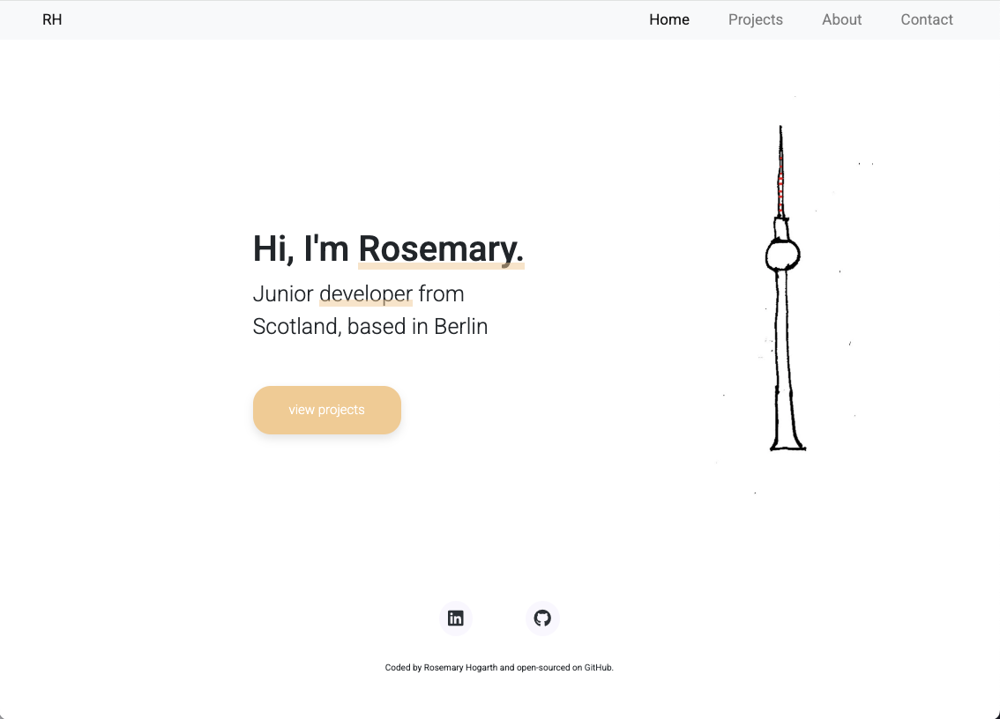
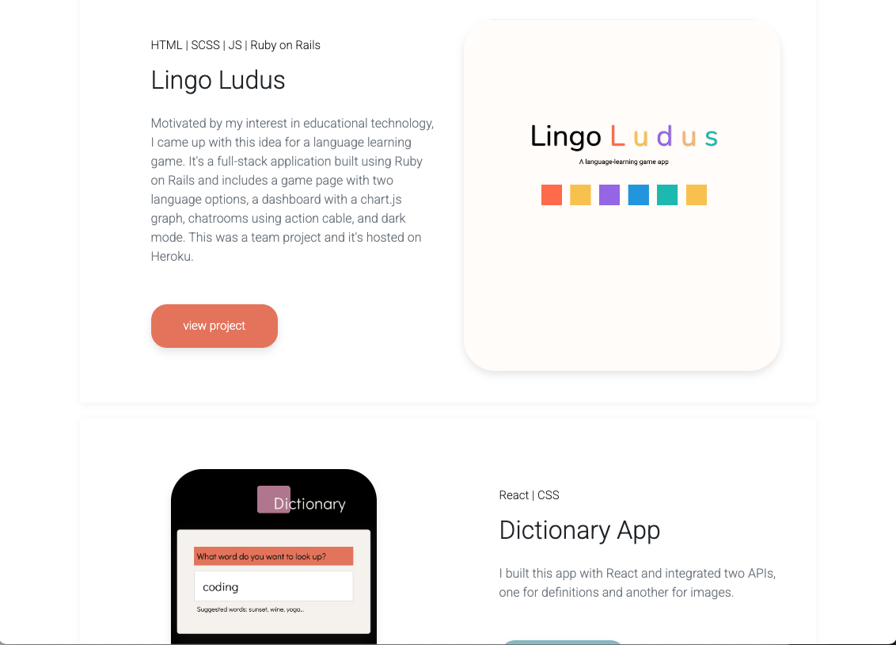
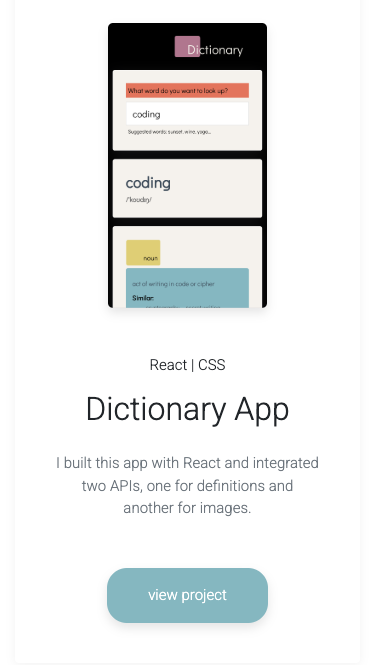
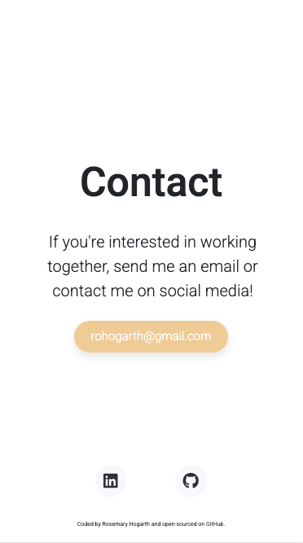

### Project Description
This is a static portfolio website for presenting my work as a developer. I wanted to create something visually pleasing that wouldn't distract from my actual web development projects.
I started the project by designing each page in Figma for mobile and desktop. On the homepage I added my own drawing of the TV Tower in Berlin to create a fun, welcoming feel.

🔗 **Live Demo:** [View the Website on Netlify](https://wondrous-sprite-d950e1.netlify.app/)  

## 📸 Screenshots  

### 🖥️ Desktop View  
  
  

### 📱 Mobile View  
    
  
## 🛠 Tech Stack  
- **Hosting:** [Netlify](https://www.netlify.com/)  
- **Styling:** CSS Grid, Flexbox  
- **Languages:** HTML, CSS, JavaScript  
